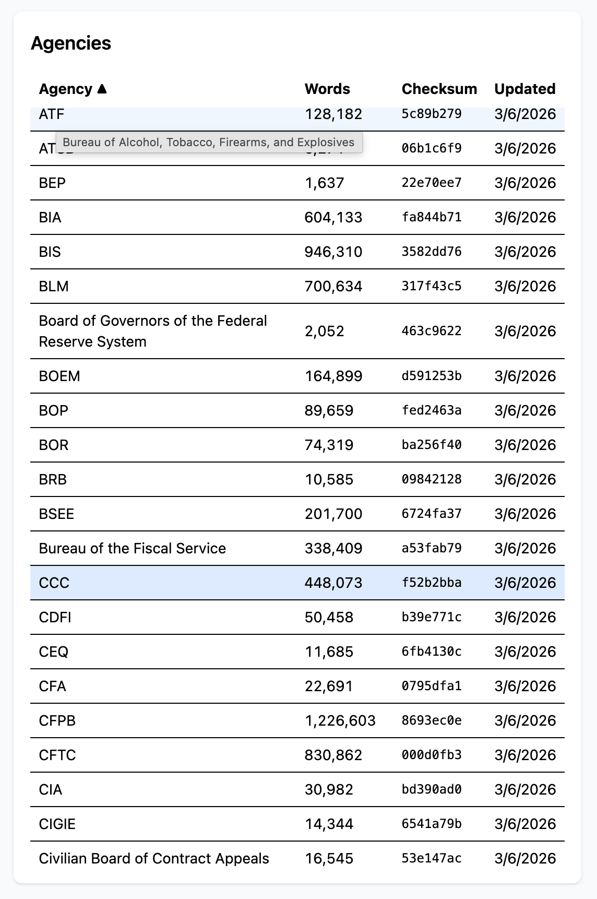
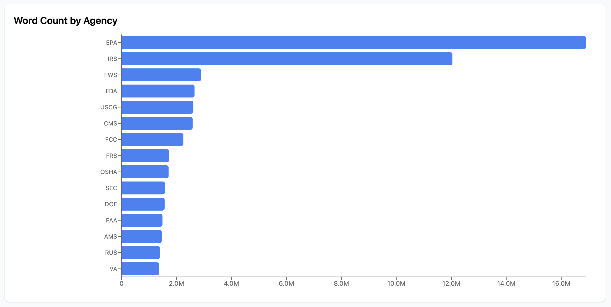
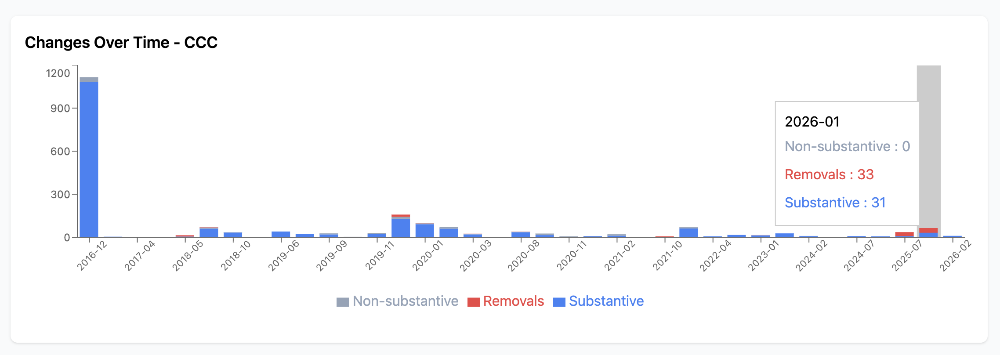
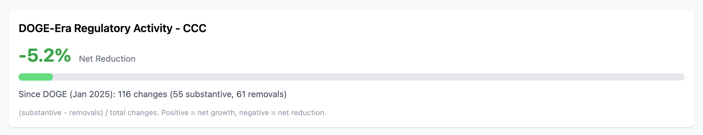
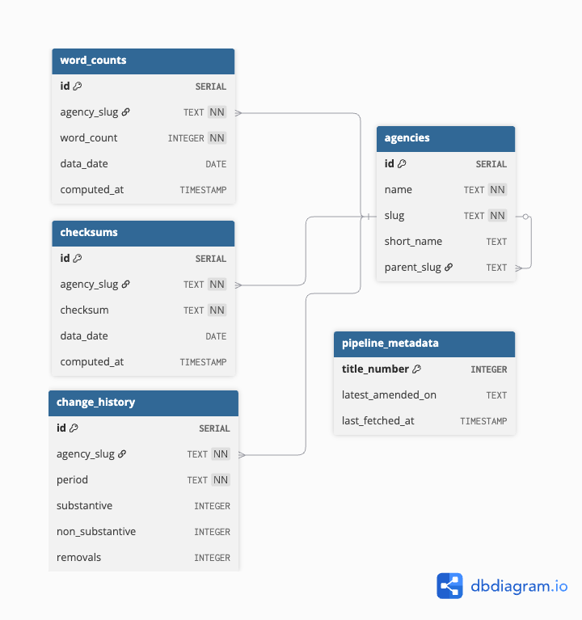
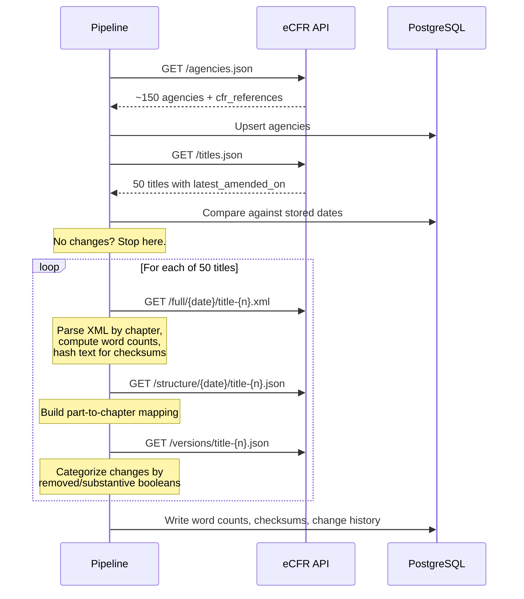
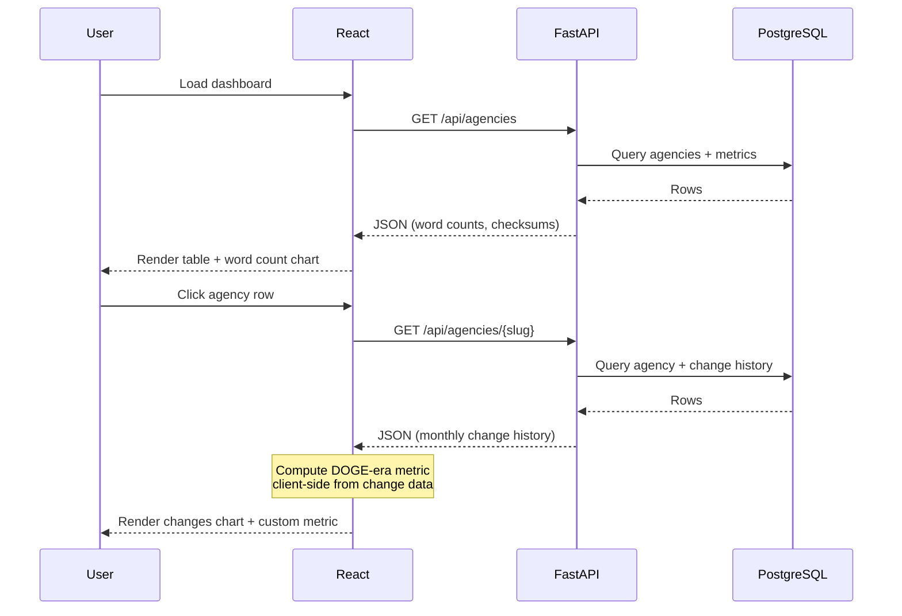

# eCFR Analyzer

A web dashboard that turns 200,000+ pages of federal regulations into digestible analytics for informing deregulation efforts.

**Live app:** https://ecfr-analyzer-kc2m.onrender.com
**API docs:** https://ecfr-analyzer-kc2m.onrender.com/docs


## Screenshots









## Architecture

Single FastAPI service serving both the REST API and the React frontend as static files. One deployment, one URL, no CORS.

```
api/
├── main.py          # App entry, lifespan, static file serving
├── database.py      # PostgreSQL connection pool + schema
├── pipeline.py      # Data fetching, parsing, metric computation
├── scheduler.py     # Daily refresh (2 AM via APScheduler)
├── models.py        # Pydantic response models
└── routes/
    └── agencies.py  # REST endpoints

client/src/
├── App.jsx          # Layout, data fetching, state
└── components/
    ├── AgencyTable.jsx     # Sortable agency list
    ├── WordCountChart.jsx  # Top agencies bar chart
    ├── ChangesChart.jsx    # Change history over time
    └── RegGrowthChart.jsx  # DOGE-era custom metric
```



### Data Pipeline

On first deploy, the pipeline populates the database from scratch. After that, a daily scheduler checks for changes and only reprocesses when titles have been amended.



### Request Flow

The frontend never touches the eCFR API. All metrics are pre-computed and served from PostgreSQL.



## How Metrics Are Computed

**Word count:** Full XML for each CFR title is parsed by chapter. Chapters map to agencies via `cfr_references` from the eCFR agencies endpoint. Word count is `len(text.split())` on the extracted text. Agencies spanning multiple titles have their counts summed across all titles.

**Checksum:** SHA-256 hash of all chapter text belonging to the agency. Computed on each pipeline run. If an agency's regulations change between runs, the hash changes, providing a quick "did anything change?" signal without re-reading content.

**Historical changes:** The eCFR versions endpoint provides section-level change records with `removed` and `substantive` boolean fields. Each entry is categorized directly:

- `removed: true` = removal
- `removed: false, substantive: true` = substantive change
- `removed: false, substantive: false` = non-substantive change

Changes are aggregated by agency and monthly period. Mapping versions to agencies requires an extra step: versions reference parts (not chapters), so the structure endpoint builds a part-to-chapter lookup table.

**Custom metric, DOGE-era net regulatory growth:** Computed client-side by filtering change history to January 2025 onward and applying `(substantive - removals) / total`. Positive = net regulatory growth, negative = net reduction. Keeping this client-side makes the API generic and the time window adjustable without backend changes.

## Tech Decisions

| Decision | Why |
|----------|-----|
| FastAPI over Django | No ORM, admin, or templating needed. Define routes, return data. Auto-generated docs at `/docs` for free. |
| PostgreSQL over SQLite | SQLite gets wiped on redeploy. PostgreSQL persists and handles concurrent reads/writes (scheduler + user requests). |
| Raw SQL over ORM | 1,200-line budget. No migrations, no model layer, no query builder overhead. |
| Single deployment | FastAPI serves API + React static files. One URL, no CORS, simpler infrastructure. |
| Titles processed one at a time | Full XML for all 50 titles won't fit in memory. Stream-parse each title, compute metrics, discard before loading the next. |

## Quick Start

```bash
# Start PostgreSQL
docker compose up -d

# Install Python dependencies
pip install -r requirements.txt

# Run the API (pipeline auto-populates on first start)
uvicorn api.main:app --reload

# In a second terminal, run the React dev server
cd client && npm install && npm run dev
```

Local dashboard: http://localhost:5173 | API docs: http://localhost:8000/docs

## AI Usage

Claude Code was used throughout development for pair programming. My workflow: write a detailed PRD and implementation roadmap first, then pair-program each step using a custom skill I built that breaks work into sub-steps with understanding checks after each one. Code was shared work. I wrote much of it directly; what Claude generated, I reviewed, understood, and adjusted where needed (catching a few cases that would have introduced major bugs). The planning documents are git-ignored but available upon request.

## Expertise Fit

Seven years of full-stack engineering across React, Python, and Node.js, plus four years leading technical instruction at Nashville Software School where I architect curricula, build production demos, and mentor developers. That teaching work is systems thinking in disguise: scoping what to include, cutting what doesn't serve the goal, and making complex systems understandable. The same instincts shaped this project, especially under a 1,200-line constraint where every abstraction has to earn its place. I used Claude Code as a pair-programming tool, not a shortcut. I built a custom skill to structure the workflow, wrote much of the code myself, and caught bugs in the code I didn't write. I can walk through every line and explain why it's there.

## Duration

Most of the time went into planning: researching the eCFR API, understanding the data model, and writing a comprehensive PRD before touching any code. From the PRD I built a step-by-step development roadmap. With both documents in place, implementation was straightforward. I chose to work through it deliberately, writing code myself and reviewing generated code in small chunks, rather than optimizing for speed. Slower, but I own the result.
